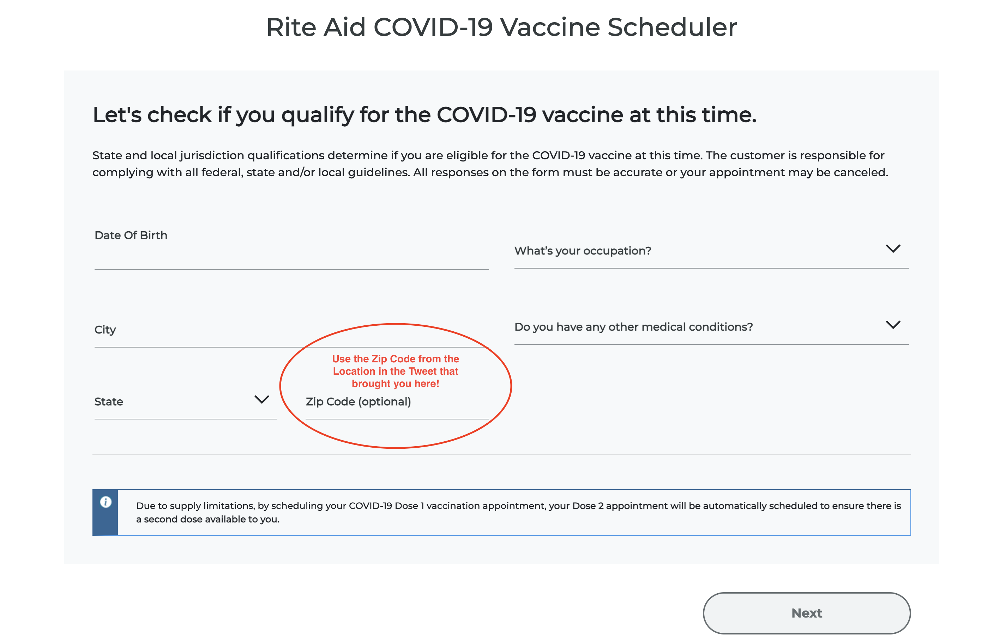
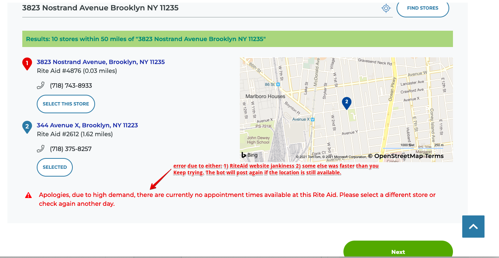
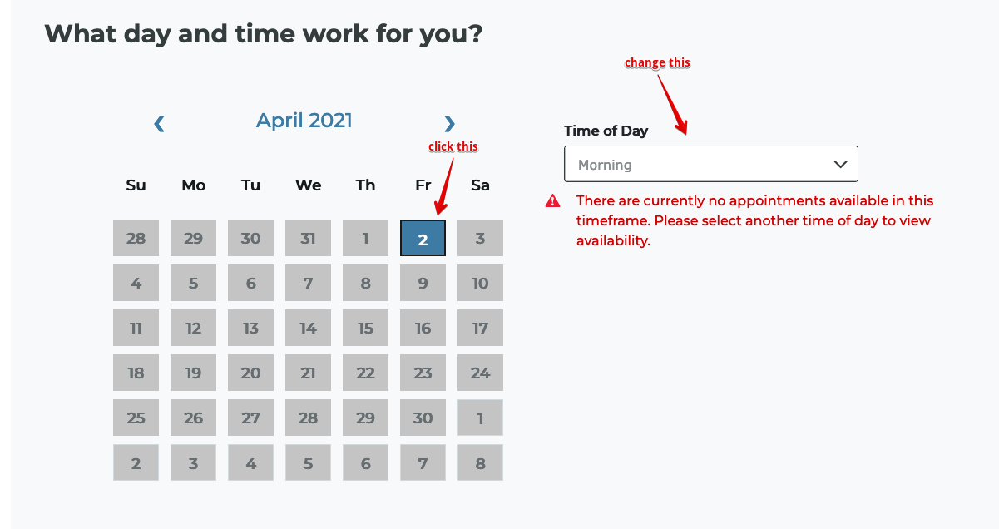

# FAQ
* In the "COVID Qualifier" form, use the zip code from the Location in the Tweet that brought you here:

* After selecting a location, you may get an errors on either the location selection screen or the calendar screen that comes next. Here's what to do about them:

* We continue to post about locations as long as they still have open slots. We'll re-post a location every 1-2 minutes if it still has slots
* If we haven't posted a location in the past 2 minutes, it probably no longer has slots.
* Sometimes Twitter rate limits our posts, so we may be unable to post updates for up to three hours.
* We monitor all Rite Aid locations in Brooklyn and Manhattan, plus a handful in Queens.
* We post Rite Aid sites with new appointments on twitter: https://twitter.com/RiteNyc 
